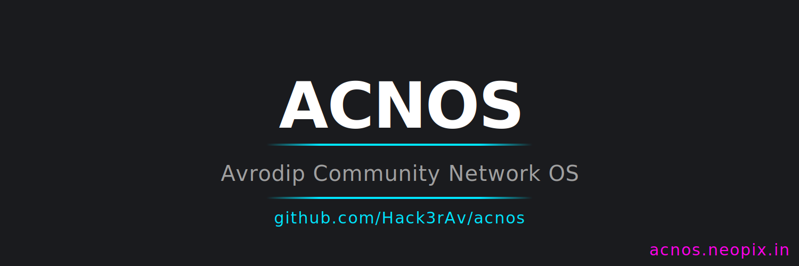

<!-- ====================================================== -->
<!--                   PROJECT BANNER                       -->
<!-- ====================================================== -->

  

<!-- Replace the image above with your banner -->
<!-- Suggested path: /assets/acnos-banner.png -->

# [ACNOS — Avrodip Community Network OS](https://acnos.neopix.in)
click on the [ACNOS](https://acnos.neopix.in) Title to visit the Website.

**Concept & Founder:** Avrodip Shee  

ACNOS is a **community-powered decentralized communication network** designed to connect people, devices, drones, sensors, and services **without fully relying on traditional telecom providers**.

The project focuses on **rural connectivity, decentralized infrastructure, and community-built networks**.

---

# 🌐 Vision

The mission of ACNOS is to create a **global decentralized communication ecosystem**.

Main goals:

- Build independent **community networks**
- Provide **free internal communication**
- Allow communities to **deploy their own network infrastructure**
- Enable **device-to-device networking**
- Support **IoT, drones, and tracking systems**
- Provide **optional paid internet access**

The system is designed to grow **organically through community expansion**.

---

# ⚙ Core Technology

ACNOS runs on a networking system called:

## ACNOS Mesh Protocol (AMP)

AMP allows nodes and towers to connect directly to each other, forming a **self-expanding mesh network**.

Each node can act as:

- Router  
- Signal relay  
- Device gateway  
- Local service host  

This architecture removes reliance on centralized telecom providers.

---

# 🛰 Infrastructure Model

## Initial Deployment

The first stage begins with installing **ACNOS towers in rural regions**.

Once the base network exists, expansion happens through:

- Community purchases
- Donations
- Organizations
- Village installations

The network naturally expands as more nodes join.

---

# 📡 Hardware Model

Communities can expand the network by installing **ACNOS Micro Towers**.

Possible installation locations:

- Rooftops
- Buildings
- Farms
- Poles
- Villages
- Societies

Each tower contains:

- Radio communication module
- Embedded computing unit
- ACNOS firmware
- Antenna
- Power system

---

# 🧠 Network Workflow

Example communication path:

**User Device → Nearest ACNOS Tower → Mesh Network Routing → Destination Tower → Receiver Device**

Communication can work **even without internet connectivity**.

---

# 📞 Communication Services

ACNOS provides multiple communication features inside the network.

## Free Calling

Voice calls within the ACNOS network work similar to VoIP but operate **entirely inside the mesh network**.

User Phone → Nearby ACNOS Tower → Mesh Network → Receiver Tower → Receiver Device.

No telecom operator required.

---

## Messaging

Users can send:

- Text messages
- Voice messages
- Files
- Images

Messages route through the **ACNOS mesh infrastructure**.

---

# 🌍 Internet Access

Internet access is **optional**.

Some towers may act as **Gateway Nodes** connected to:

- Fiber
- ISP
- Satellite internet

Example flow:

**User Device → ACNOS Tower → Mesh Network → Internet Gateway Node → Public Internet**

Internet access may require **subscription plans**.

---

# 🚁 Drone Connectivity

ACNOS supports **long-range drone communication**.

**Drone → Nearby Tower → Mesh Network → Control Device**

Possible uses:

- Agriculture monitoring
- Rural surveillance
- Emergency response
- Delivery experiments

---

# 📍 Tracker Devices

ACNOS supports low-energy trackers such as:

- Livestock trackers
- Asset trackers
- Personal trackers

Similar concept to **AirTag-style systems**, but powered by **community infrastructure**.

---

# 🌱 IoT Integration

ACNOS can connect smart devices like:

- Farm sensors
- Weather stations
- Smart lighting
- Security cameras
- Automation systems

---

# 🧩 Local Network Services

Even without internet, ACNOS nodes can host:

- Local websites
- Community announcements
- Education content
- Local file sharing
- Emergency communication systems

---

# 🚀 Future Vision

Future phases may include:

- ACNOS Satellite Infrastructure
- ACNOS SIM Technology
- Global decentralized telecom network

The ultimate goal is **community-owned communication infrastructure**.

---

# 🔗 Links

### [GitHub](https://github.com/Hack3rAv) | ### [Instagram](https://www.instagram.com/neopix.india)
# 📝 Notes

- ACNOS is currently in **early conceptual development**
- Documentation will expand as the project evolves
- Developers Help is Greatly Appreciated
- Contribute your skills to make humanity independent.
---

# 👤 Author

**Avrodip Shee**
Creator of **ACNOS (Avrodip Community Network Operating System)**
